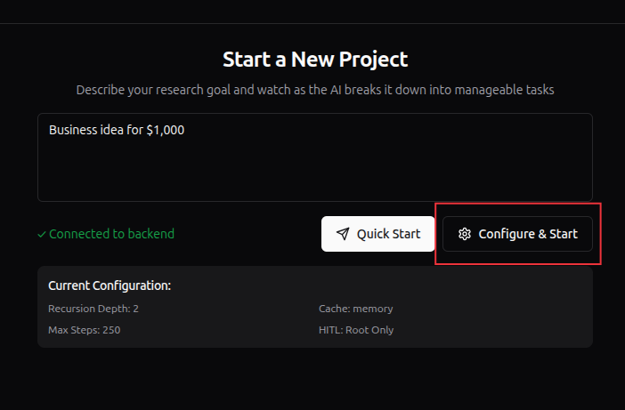
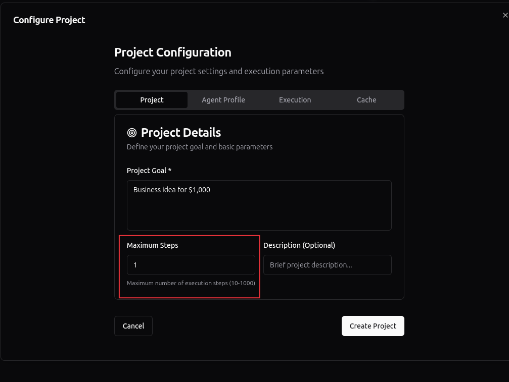
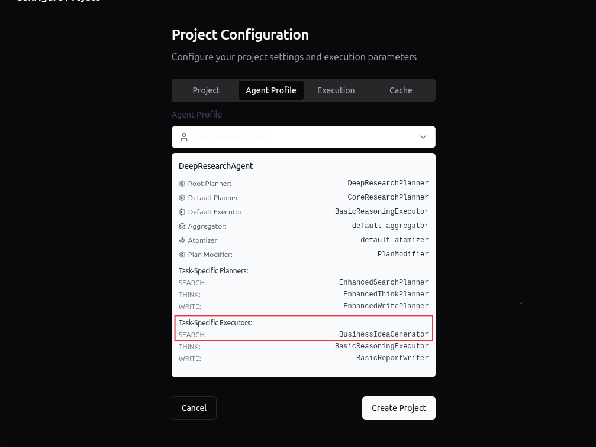
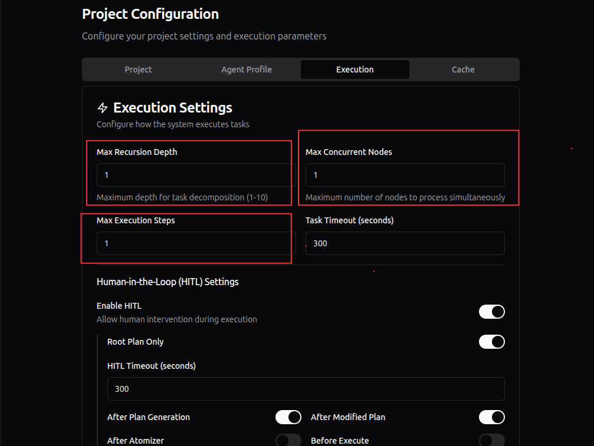
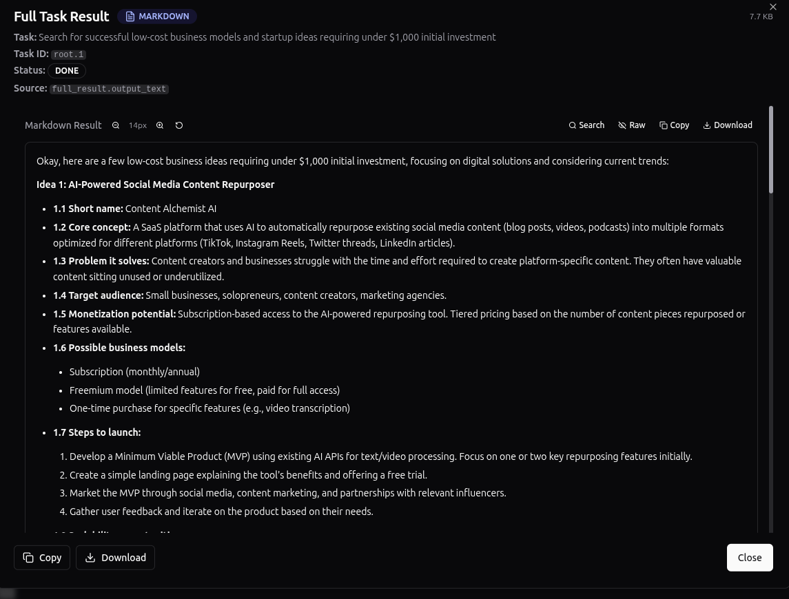

# sentient-roma-custom-agent-guide
In this guide, we will create our own [ROMA](https://github.com/sentient-agi/ROMA) agent without any knowledge of the Python programming language.

First, we need to understand that there are 4 types of Agents:

1. Atomizer Agents
2. Planner Agents
3. Executor Agents
4. Aggregator Agents

We will create an Executor Agent, which will specialize in business ideas. To begin, we need to describe our agent.
Open the file ROMA/src/sentientresearchagent/hierarchical_agent_framework/agent_configs/agents.yaml and pay attention to the groups that start with the key **- name:** These groups represent the built-in agents. 
In this file, we can add our own agent. **Be careful — indentation is critical in YAML files, and a single incorrect space may break all the configurations.**

Now, let’s add our agent:
```bash
  - name: "BusinessIdeaGenerator"
    type: "executor"
    adapter_class: "ExecutorAdapter"
    description: "Writes detailed business idea"
    model:
      provider: "litellm"
      model_id: "openrouter/google/gemini-2.0-flash-exp:free"
    prompt_source: "prompts.executor_prompts.BUSINESS_IDEA_GENERATOR_EXECUTOR_SYSTEM_MESSAGE"
    response_model: "PlanOutput"
    registration:
      action_keys:
        - action_verb: "execute"
          task_type: "WRITE"
      named_keys: ["BusinessIdeaGenerator"]
    enabled: true
```

In this example, we specify the free model openrouter/google/gemini-2.0-flash-exp:free, but you can choose any model that suits you.

Notice the line:
prompt_source: "prompts.executor_prompts.BUSINESS_IDEA_GENERATOR_EXECUTOR_SYSTEM_MESSAGE". This is the agent’s system prompt. 
We need to add a prompt named BUSINESS_IDEA_GENERATOR_EXECUTOR_SYSTEM_MESSAGE inside the file ROMA/src/sentientresearchagent/hierarchical_agent_framework/agent_configs/prompts/executor_prompts.yaml. 
Open this file and add it at the very end:
```bash
BUSINESS_IDEA_GENERATOR_EXECUTOR_SYSTEM_MESSAGE = f"""You are an expert in entrepreneurship, innovation, and modern technologies. Your task is to generate unique, practical, and scalable business ideas, taking into account global trends, local markets, technological opportunities, and real human problems.

### Objectives:

1. Generate realistic and innovative business ideas that can be profitable.
2. Consider the user’s budget, region, target audience, and skill level.
3. Provide a structured response that includes:
   3.1. Short name of the idea
   3.2. Core concept (2–3 sentences)
   3.3. Problem it solves
   3.4. Target audience
   3.5. Monetization potential
   3.6. Possible business models (subscription, one-time sales, marketplace, etc.)
   3.7. Steps to launch (step-by-step initial actions)
   3.8. Scalability opportunities

### Rules:

1. Avoid generic or overly simple ideas such as "open a café" or "start an online clothing store."
2. Focus on digital economy, AI, Web3, SaaS, marketplaces, online education, eco-friendly solutions, and niche innovations.
3. Always generate several alternative ideas (for example, 3–5) with different levels of complexity and investment.
4. Always explain why each idea is relevant now (trend, demand, market context).

### Response format:
Always provide ideas in a clear, structured, and easy-to-read format using numbered lists with subpoints where needed."""
```

Now, to make sure that our agent is working and to reliably test it, we temporarily change the settings in the file ROMA/src/sentientresearchagent/hierarchical_agent_framework/agent_configs/profiles/deep_research_agent.yaml.

Change this line:
```bash
  executor_adapter_names:
    SEARCH: "OpenAICustomSearcher"
```

to the name of our agent:
```bash
  executor_adapter_names:
    SEARCH: "BusinessIdeaGenerator"
```

Next, go to http://localhost:3000/.

Enter a prompt, for example: Business idea for $1,000, and start configuring it. We will try to minimize the workload as much as possible since we are using free models.

1.


2.


3. Во вкладке Agent Profile, выбираем DeepResearchAgent. Как видим, наш агент указан как по умолчанию


4.


Click Create Project.
Here’s the result I got:

